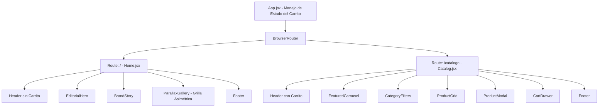

# Diseño: Separación de Página Principal y Catálogo con Parallax Editorial

Este documento define la especificación técnica y de diseño para separar la experiencia actual de **Bella Forever** en dos páginas: una Landing Page editorial con efectos de scroll parallax y una página dedicada al Catálogo de compras.

---

## 1. Objetivos

- **Separación de Responsabilidades:** Separar la bienvenida inspiracional y de marca de la interfaz transaccional del catálogo.
- **Efecto Parallax Asimétrico:** Implementar una galería de imágenes tipo collage editorial que reaccione al scroll usando GSAP y ScrollTrigger.
- **Navegación Fluida:** Integrar `react-router-dom` para manejar rutas limpias (`/` y `/catalogo`), manteniendo el estado del carrito en toda la aplicación.

---

## 2. Arquitectura de Rutas y Estado

Utilizaremos `react-router-dom` para declarar dos rutas principales:

1. **Ruta Raíz (`/`):** Renderiza `Home.jsx` (Landing Page).
2. **Ruta Catálogo (`/catalogo`):** Renderiza `Catalog.jsx` (Catálogo con filtros y carrito).

El estado del carrito (`cart`) se mantendrá en un componente contenedor principal (`App.jsx` o similar) y se pasará a través de props o contexto de React para evitar que se pierdan las compras al navegar entre páginas.

---

## 3. Distribución de Componentes

### Componentes Nuevos / Modificados

- **`src/pages/Home.jsx` [NUEVO]:** Contiene la estructura de la landing page.
- **`src/pages/Catalog.jsx` [NUEVO]:** Contiene toda la lógica del catálogo actual.
- **`src/components/ParallaxGallery.jsx` [NUEVO]:** Componente para la grilla asimétrica en la landing page.
- **`src/components/Header.jsx` [MODIFICAR]:** Mostrar u ocultar el botón del carrito según la ruta activa.
- **`src/App.jsx` [MODIFICAR]:** Configurar el Router y pasar el estado del carrito a las páginas respectivas.

---

## 4. Diseño del Parallax Asimétrico (`ParallaxGallery`)

El componente `ParallaxGallery` mostrará una grilla de imágenes de alta resolución utilizando las imágenes existentes o de Unsplash. 

- **Estructura Visual:** 4 a 5 imágenes distribuidas de manera asimétrica (unas más grandes, unas flotando a la izquierda, otras a la derecha).
- **Animación (GSAP ScrollTrigger):**
  - Cada imagen se moverá verticalmente a una velocidad diferente (`yPercent` de `-15` a `-40` o similar) con `scrub: true`.
  - Animación de revelado al entrar al viewport (Fade In y Scale Up).
- **Interactividad:** Al hacer click en cualquier imagen de la galería, se aplicará una transición fluida que redirigirá al usuario a `/catalogo`.

---

## 5. Plan de Verificación

### Pruebas Manuales
- Verificar que al entrar a `/` se muestre la Landing Page y no el catálogo de productos.
- Hacer scroll en la Landing Page y validar el efecto de parallax asimétrico en las imágenes de la galería.
- Validar que al hacer clic en las imágenes de la galería o el botón CTA, se redirija correctamente a `/catalogo`.
- Agregar un producto al carrito en `/catalogo`, navegar de regreso al inicio `/` y regresar al catálogo, asegurando que los productos sigan en el carrito.
- Probar la funcionalidad de checkout en WhatsApp en la nueva página `/catalogo`.
